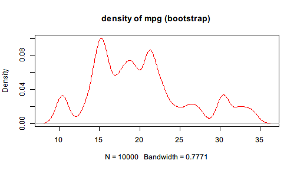

# First example

Suppose we are dealing with the built-in dataset `mtcars` and want to get a rough impression on the energy efficiency of the cars in the sample. One way is to see how `mpg`, miles per gallon, is distributed. Since the sample size is relatively small, we decide to perform some bootstrap re-sampling over `mpg`.

The traditional code is the following:


```r
sample_mtcars <- sample(mtcars$mpg, 10000, replace = TRUE)
density_mtcars <- density(sample_mtcars, kernel = "gaussian")
plot(density_mtcars, col = "red", main="density of mpg (bootstrap)")
```

 

The traditional approach introduces some intermediate variables which may be used only once. If one wants to avoid these variables and combine the lines together, the code will become

```r
plot(density(sample(mtcars$mpg, size = 10000, replace = TRUE), 
  kernel = "gaussian"), col = "red", main="density of mpg (bootstrap)")
```

You may find that the code is less readable because it is nested and counter-intuitive.
The code must finish the three steps below: 

1. Resample from `mtcars$mpg`
2. Perform a kernel estimation of its distribution
3. Plot the estimated density function

However, in the compact version above, the order of functions are written exactly in the opposite order. It is not only hard to read, but also hard to write and maintain. 

Imagine when you need to insert a step to clean the data before plugging it to re sampling, then more intermediate variables may be introduced, or the code may become more nested. Also imagine when you have to remove a step from the code, it will be easy to make mistakes when parentheses mismatch or you forget to change the subsequent code.

Suppose you suddenly realize that the data should be filtered first. You need to remove the extreme values, say, the lower and upper 0.05 quantile. Then the code becomes

```r
filtered_mtcars <- subset(mtcars,
  mpg >= quantile(mpg, 0.05) & mpg <= quantile(mpg, 0.95))
sample_mtcars <- sample(filtered_mtcars$mpg, 10000, replace = TRUE)
density_mtcars <- density(sample_mtcars, kernel = "gaussian")
plot(density_mtcars, col = "red", main="density of mpg (bootstrap)")
```

or a compact version which is hardly readable:

```r
plot(density(sample(subset(mtcars,
  mpg >= quantile(mpg, 0.05) & mpg <= quantile(mpg, 0.95))$mpg, 
  size = 10000, replace = TRUE), 
  kernel = "gaussian"), 
  col = "red", main="density of mpg (bootstrap)")
```

You may notice that all these functions take the data as the first argument. Therefore, pipeR provides a Pipe operator `%>>%` that inserts the left-hand side value to the first argument of the right-hand side function.

Basically, `x %>>% f(...)` will be evaluated as `f(x,...)`. This allows us to rewrite the above example in a much fluent style. We are enabled to build pipelines to manipulate data.

The original example can be rewritten as

```r
mtcars$mpg %>>%
  sample(size = 10000, replace = TRUE) %>>%
  density(kernel = "gaussian") %>>%
  plot(col = "red", main = "density of mpg (bootstrap)")
```

Even if we realize that the data needs some filtering, it is easy to add a step in the pipeline.

```r
mtcars %>>%
  subset(mpg >= quantile(mpg, 0.05) & mpg <= quantile(mpg, 0.95)) %>>%
  (mpg) %>>%
  sample(size = 10000, replace = TRUE) %>>%
  density(kernel = "gaussian") %>>%
  plot(col = "red", main = "density of mpg (bootstrap)")
```

You may not be familiar with the above syntax yet. But you will probably be correct if you try to guess what happens in each step. pipeR tries to make the syntax as simple and intuitive as possible to make unified yet flexible pipeline experience.

In this next page, more details are provided to explain the design principles of the pipeR along with the syntax.
